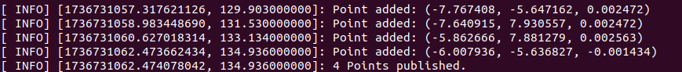
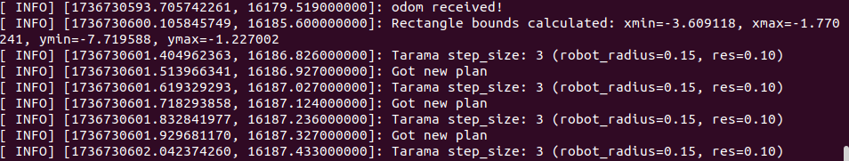
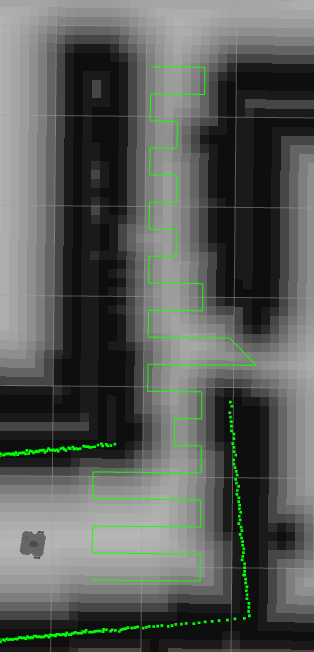
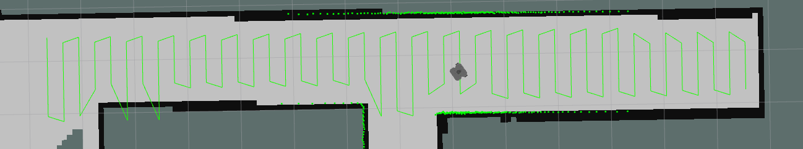
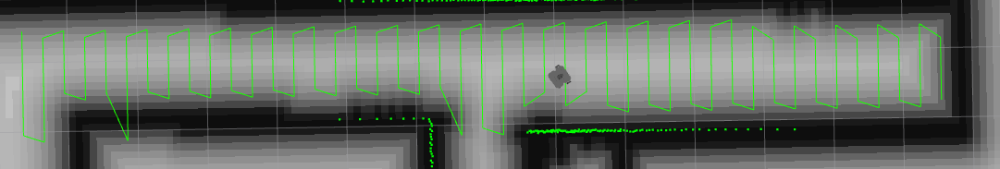
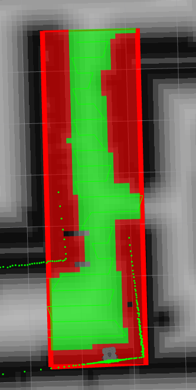
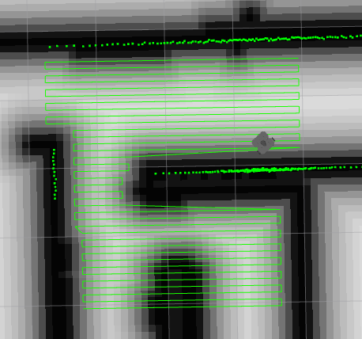

## Kurulum ve Gereksinimler
Kurulumda ekstra bir şey yapılmasına gerek yoktur. Sadece EuclidPlanner global_planner plugininden çağrılmalıdır.
move_base.launch dosyasını güncellemeyi unutmayın.

### 1. Publish Point

RVIZ ekranında Publish Point butonu yardımıyla poligonun köşelerini belirleyen ve 4. nokta seçildikten sonra Float32MultiArray pointleri yayımlayan node.

```
rosrun polygon_publisher polygon_publisher
```
<p>

</p>

### 2. Projenin Çalıştırılması
```
roslaunch turtlebot3_navigation move_base.launch
```
<p>

</p>

### 3. Sonuçlar
<p>

</p>

<p>

</p>

<p>

</p>

#### Engellerin Görselleştirilmesi

<p>

</p>


#### Hatalı Case
Tarama algoritmasındaki hatalı durum.

<p>

</p>
